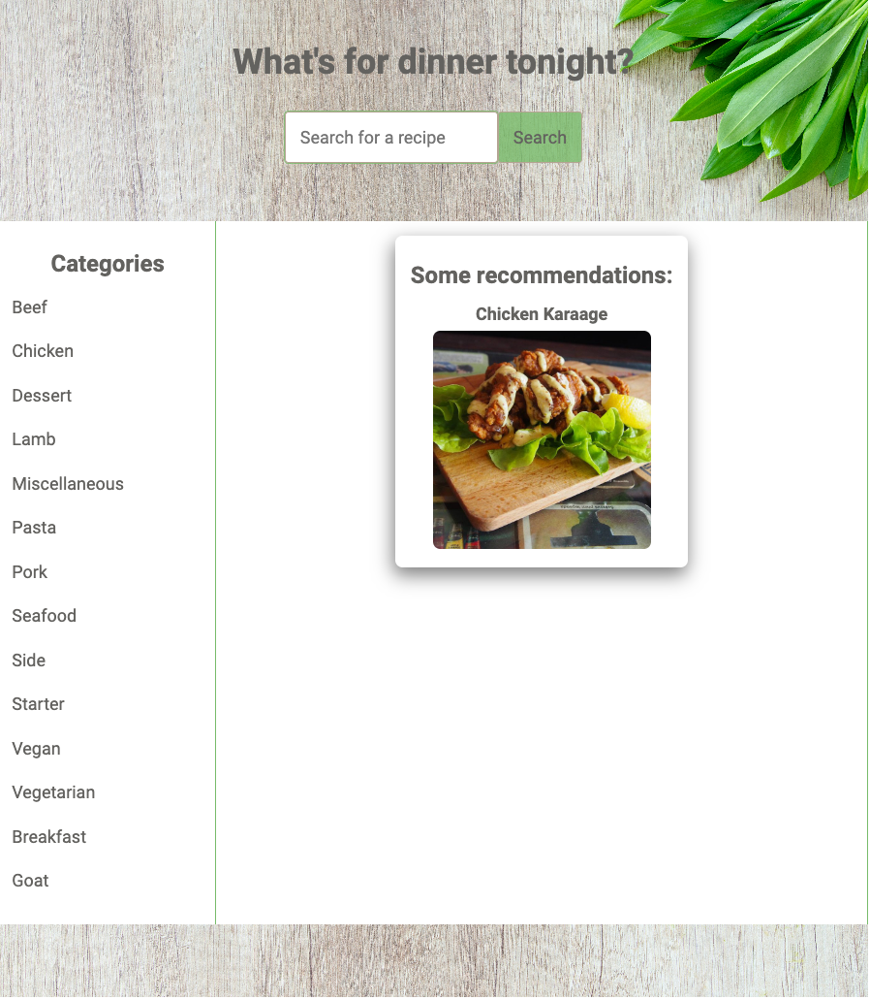
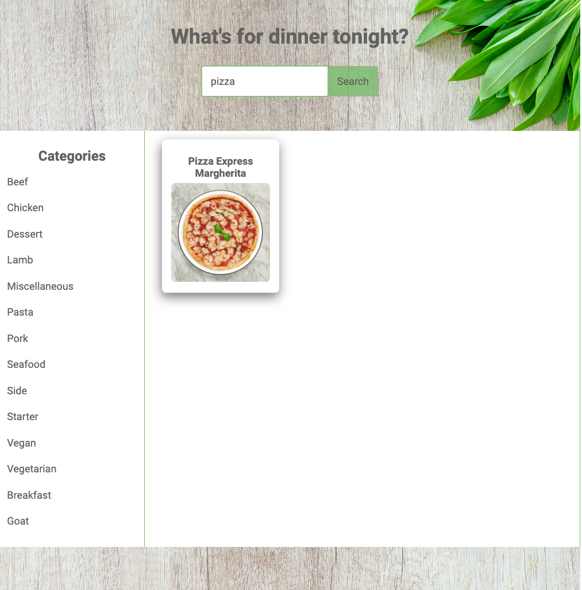
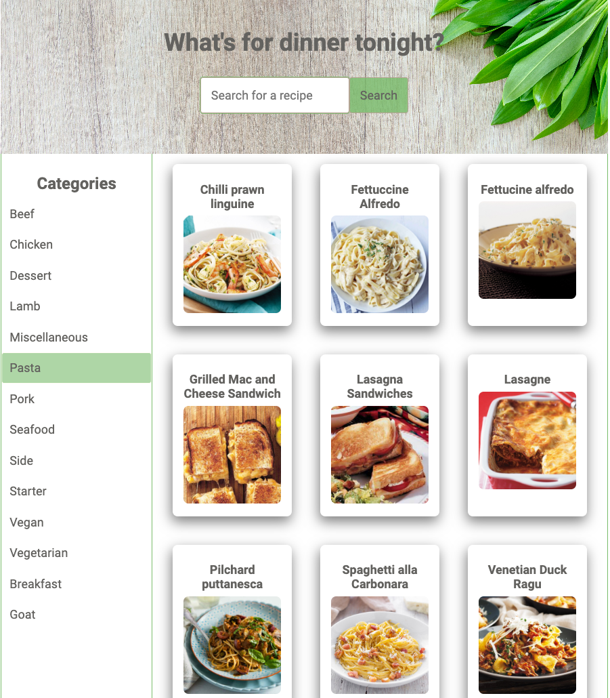
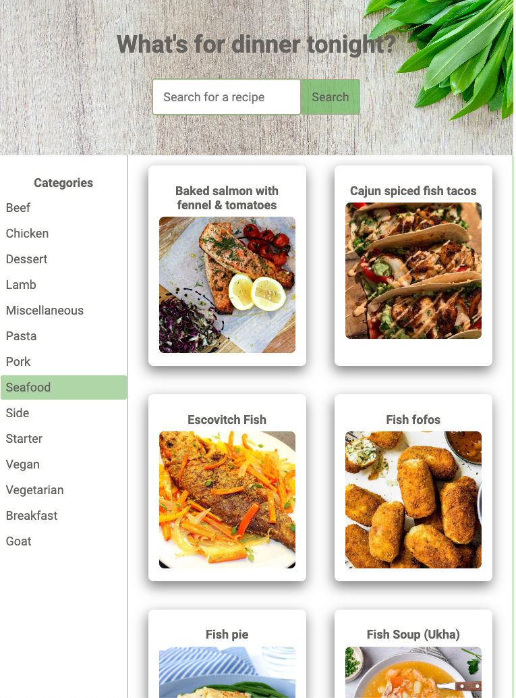
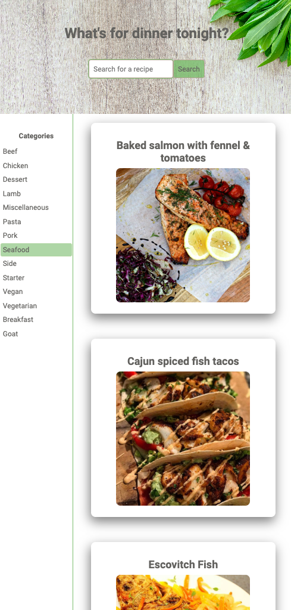
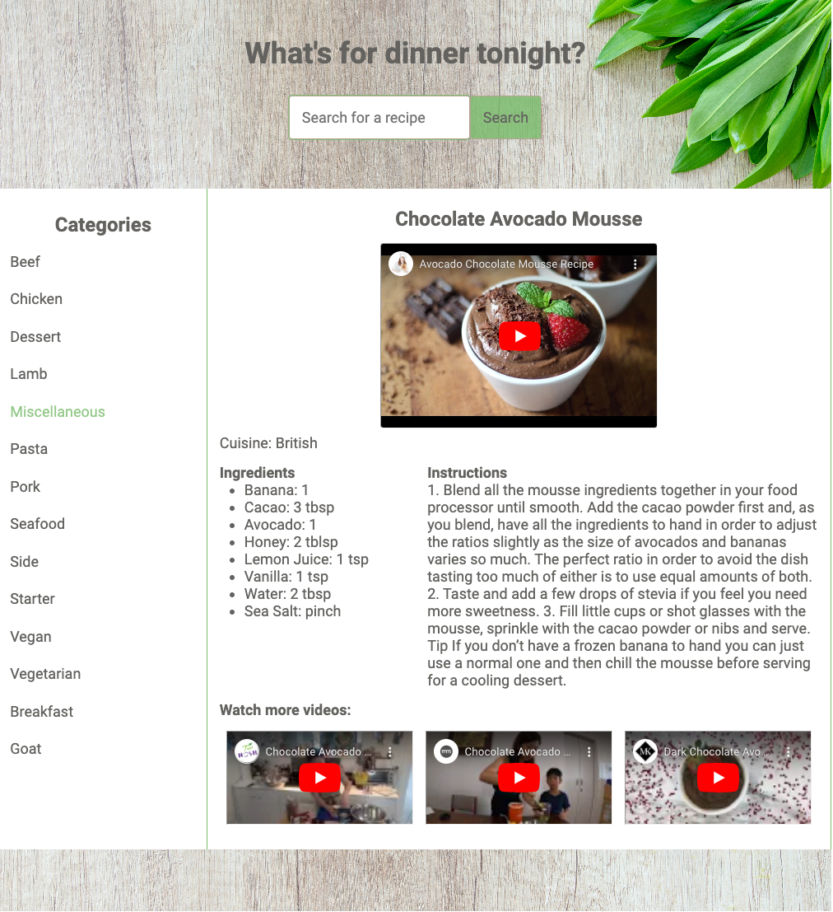

# What's for dinner tonight ?

[Deployed App: What's for dinner tonight?](https://celinero.github.io/whats-for-dinner-tonight/)

## Table of Contents

- [Overview](#overview)
- [Screnshots](#screenshot)
- [External APIs](#external-apis)
- [Unsolved problems](#unsolved-problems)
- [Future features](#future-features)

## Overview

This app is about cooking recipes. Getting inspired for your next meal!

It has several functionalities:

- giving some recommendation
- searching with a keyword
- exploring the different categories
- then the recipes related to it
- finally explaining how to make theses recipes with detailed information and videos

## Screenshots

_Home page_

_Using the form to search for a specific recipe_

_When a category is clicked, recipe cards are shown_

_Responsive view for smaller screen_

_Responsive view for phone_

_When the user clicks on one of the recipe card, he can see the recipe details with sevral videos, ingredients list and instructions_

## External APIS

2 APIS:

- [The Meal DB API](https://www.themealdb.com/api.php)
- [YouTube API](https://www.googleapis.com/youtube/v3/search)

How to use:
This app can operate 5 API calls:

- recommendations on main page, which come automatically and change when the app is reloading from the MEAL DB
  `https://www.themealdb.com/api/json/v1/1/random.php`
- search a recipe with a form: the user can type any value in the input then click on the search button from the MEAL DB
  `https://www.themealdb.com/api/json/v1/1/search.php?s=${searchTerm}`
- fetch categories on sidebar: comes automatically
  `https://www.themealdb.com/api/json/v1/1/categories.php`
- show recipe details including a video from meal DB API call, the list of ingredients and instructions
  `https://www.themealdb.com/api/json/v1/1/lookup.php?i=${idMeal}`
- display 3 videos from YouTube API call
  `${youtubeAPIURL}?${new URLSearchParams(params)}`

## Unsolved Problems

Challenges:

- how to make work the video data from the meal DB Api call. The key strYoutube url wasn't working with iframe. I had to split the source and replace "watch?v=" by "embed"
- how to insert html correctly with innerHTML especially on showRecipeDetails: when loopings through ingredients and measures

Issues to resolve:

- Replace the video link when the one from the meal data linked is unavailable

## Future Features

- increase the size of main video
- search recipes by cuisine type
- the users could attribute a note/stars to the recipe or add comments
